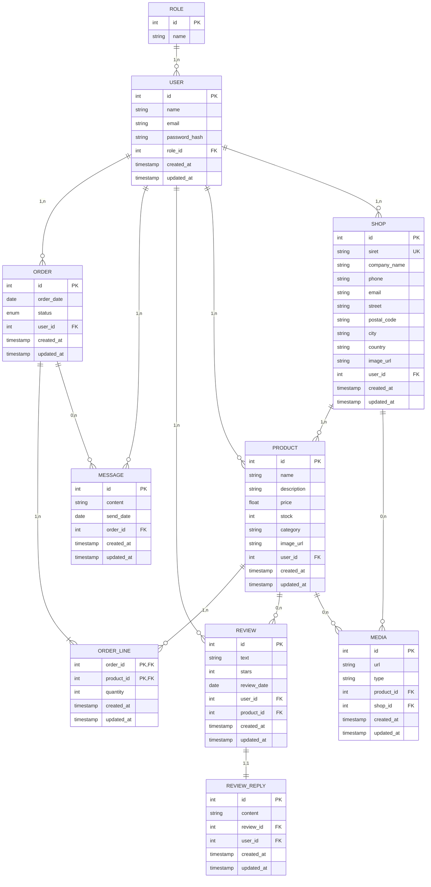

```mermaid

erDiagram

    ROLE {
        int id PK
        string name
    }

    USER {
        int id PK
        string name
        string email
        string password_hash
        int role_id FK
        timestamp created_at
        timestamp updated_at
    }

    SHOP {
        int id PK
        string siret UK
        string company_name
        string phone
        string email
        string street
        string postal_code
        string city
        string country
        string image_url
        int user_id FK
        timestamp created_at
        timestamp updated_at
    }

    PRODUCT {
        int id PK
        string name
        string description
        float price
        int stock
        string category
        string image_url
        int user_id FK
        timestamp created_at
        timestamp updated_at
    }

    ORDER {
        int id PK
        date order_date
        enum status
        int user_id FK
        timestamp created_at
        timestamp updated_at
    }

    ORDER_LINE {
        int order_id PK, FK
        int product_id PK, FK
        int quantity
        timestamp created_at
        timestamp updated_at
    }

    MESSAGE {
        int id PK
        string content
        date send_date
        int order_id FK
        timestamp created_at
        timestamp updated_at
    }

    REVIEW {
        int id PK
        string text
        int stars
        date review_date
        int user_id FK
        int product_id FK
        timestamp created_at
        timestamp updated_at
    }

    REVIEW_REPLY {
        int id PK
        string content
        int review_id FK
        int user_id FK
        timestamp created_at
        timestamp updated_at
    }

    MEDIA {
        int id PK
        string url
        string type
        int product_id FK
        int shop_id FK
        timestamp created_at
        timestamp updated_at
    }

    ROLE ||--o{ USER : "1,n"
    USER ||--o{ ORDER : "1,n"
    USER ||--o{ MESSAGE : "1,n"
    USER ||--o{ REVIEW : "1,n"
    USER ||--o{ PRODUCT : "1,n"
    USER ||--o{ SHOP : "1,n"
    SHOP ||--o{ PRODUCT : "1,n"
    SHOP ||--o{ MEDIA : "0,n"
    PRODUCT ||--o{ ORDER_LINE : "1,n"
    PRODUCT ||--o{ REVIEW : "0,n"
    PRODUCT ||--o{ MEDIA : "0,n"
    ORDER ||--|{ ORDER_LINE : "1,n"
    ORDER ||--o{ MESSAGE : "0,n"
    REVIEW ||--|| REVIEW_REPLY : "1,1"

```
