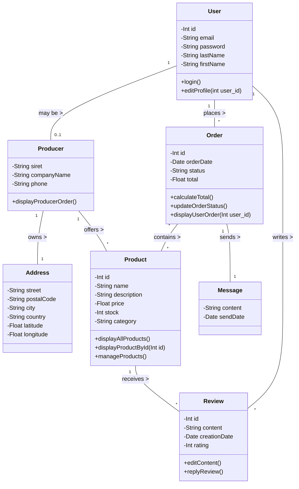

```mermaid

classDiagram
    class User {
        -Int id
        -String email
        -String password
        -String lastName
        -String firstName
        +login()
        +editProfile(int user_id)
    }

    class Producer {
        -String siret
        -String companyName
        -String phone
        +displayProducerOrder()
    }

    class Address {
        -String street
        -String postalCode
        -String city
        -String country
        -Float latitude
        -Float longitude
        %% +getCoordinates()
    }

    class Message {
        -String content
        -Date sendDate
    }

    class Product {
        -Int id
        -String name
        -String description
        -Float price
        -Int stock
        -String category
        +displayAllProducts()
        +displayProductById(Int id)
        +manageProducts()
        %% +modifyStock()
        %% +addPhoto()
    }

    class Order {
        -Int id
        -Date orderDate
        -String status
        -Float total
        +calculateTotal()
        +updateOrderStatus()
        +displayUserOrder(Int user_id)
    }

    class Review {
        -Int id
        -String content
        -Date creationDate
        -Int rating
        +editContent()
        +replyReview()
    }

    User "1" -- "0..1" Producer : may be >
    Producer "1" -- "1" Address : owns >
    Producer "1" -- "*" Product : offers >
    User "1" -- "*" Order : places >
    Order "*" -- "*" Product : contains >
    Order "1" -- "1" Message : sends >
    User "1" -- "*" Review : writes >
    Product "1" -- "*" Review : receives >
```
