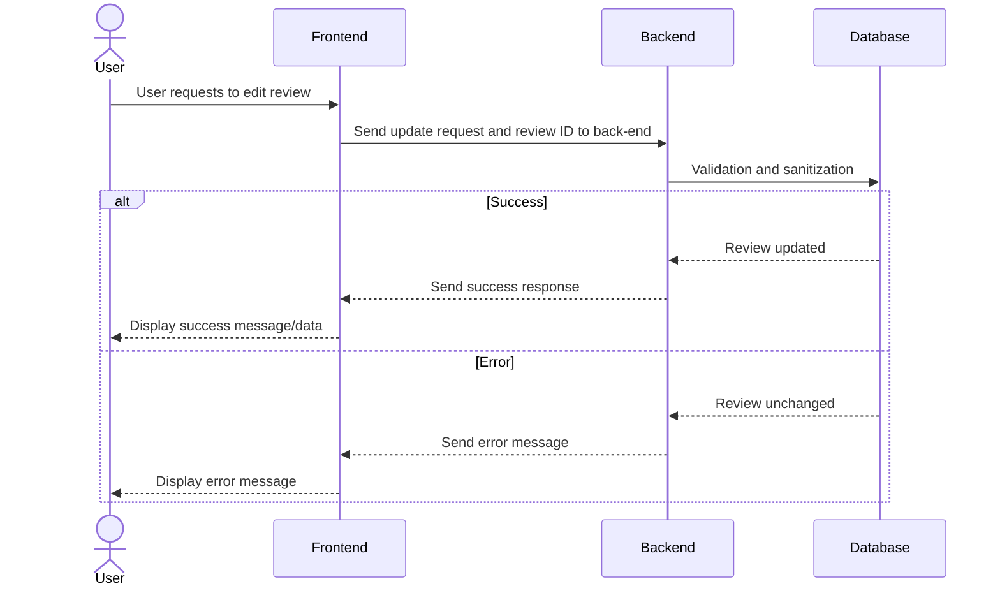

```mermaid
sequenceDiagram
    actor User
    participant Frontend
    participant Backend
    participant Database

    User->>Frontend: User requests to edit review
    Frontend->>Backend: Send update request and review ID to back-end
    Backend->>Database: Validation and sanitization

    alt Success
        Database-->>Backend: Review updated
        Backend-->>Frontend: Send success response
        Frontend-->>User: Display success message/data
    else Error
        Database-->>Backend: Review unchanged
        Backend-->>Frontend: Send error message
        Frontend-->>User: Display error message
    end
```