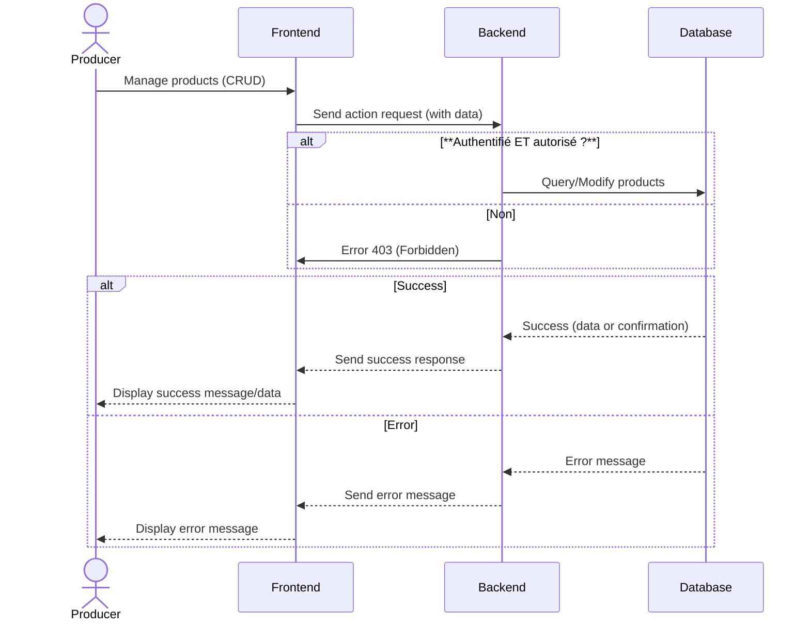

```mermaid
sequenceDiagram
    actor Producer
    participant Frontend
    participant Backend
    participant Database

    Producer->>Frontend: Manage products (CRUD)
    Frontend ->> Backend : Send action request (with data)
    alt **Authentifié ET autorisé ?**
    Backend ->> Database : Query/Modify products
    else Non
    Backend ->> Frontend : Error 403 (Forbidden)
    end
    alt Success
        Database-->>Backend: Success (data or confirmation)
        Backend-->>Frontend: Send success response
        Frontend-->>Producer: Display success message/data
    else Error
        Database-->>Backend: Error message
        Backend-->>Frontend: Send error message
        Frontend-->>Producer: Display error message
    end
```
