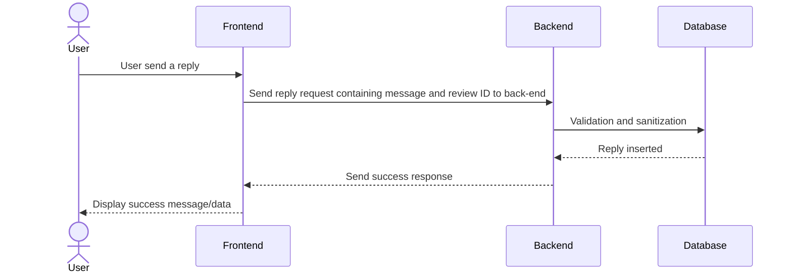

```mermaid
sequenceDiagram
    actor User
    participant Frontend
    participant Backend
    participant Database

    User->>Frontend: User send a reply
    Frontend->>Backend: Send reply request containing message and review ID to back-end
    Backend->>Database: Validation and sanitization

    Database-->>Backend: Reply inserted 
    Backend-->>Frontend: Send success response
    Frontend-->>User: Display success message/data
```