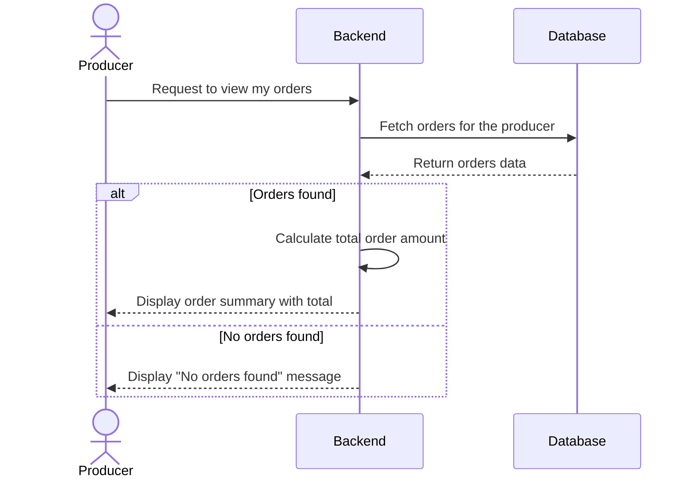

```mermaid
sequenceDiagram
    actor Producer
    participant Backend
    participant Database

    Producer ->> Backend: Request to view my orders
    Backend ->> Database: Fetch orders for the producer
    Database -->> Backend: Return orders data
    alt Orders found
        Backend ->> Backend: Calculate total order amount
        Backend -->> Producer: Display order summary with total
    else No orders found
        Backend -->> Producer: Display "No orders found" message
    end
```
