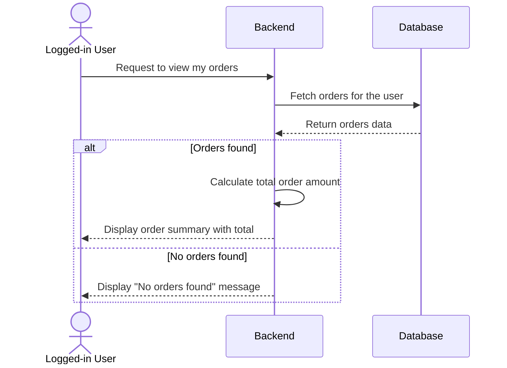

```mermaid
sequenceDiagram
    actor U as Logged-in User
    participant Backend
    participant Database

    U ->> Backend: Request to view my orders
    Backend ->> Database: Fetch orders for the user
    Database -->> Backend: Return orders data
    alt Orders found
        Backend ->> Backend: Calculate total order amount
        Backend -->> U: Display order summary with total
    else No orders found
        Backend -->> U: Display "No orders found" message
    end
```