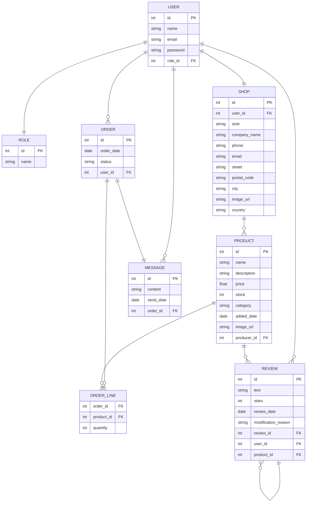

```mermaid
erDiagram

    USER {
        int id PK
        string name
        string email
        string password
        int role_id FK
    }

    ROLE {
        int id PK
        string name
    }

    PRODUCT {
        int id PK
        string name
        string description
        float price
        int stock
        string category
        date added_date
        string image_url
        int producer_id FK
    }

    SHOP {
        int id PK
        int user_id FK
        string siret
        string company_name
        string phone
        string email
        string street
        string postal_code
        string city
        string image_url
        string country
    }

    ORDER {
        int id PK
        date order_date
        string status
        int user_id FK
    }

    ORDER_LINE {
        int order_id FK
        int product_id FK
        int quantity
    }

    MESSAGE {
        int id PK
        string content
        date send_date
        int order_id FK
    }

    REVIEW {
        int id PK
        string text
        int stars
        date review_date
        string modification_reason
        int review_id FK
        int user_id FK
        int product_id FK
    }

    %% REPLY {
    %%     int id PK
    %%     int review_id FK
    %%     int user_id FK
    %%     string content
    %%     date reply_date
    %% }

    USER ||--o{ ORDER : ""
    USER ||--o{ REVIEW : ""
    USER ||--|| SHOP : ""
    USER ||--|| ROLE : ""
    USER ||--o{ MESSAGE : ""
    ORDER ||--o{ ORDER_LINE : ""
    ORDER ||--|| MESSAGE : ""
    SHOP ||--o{ PRODUCT : ""
    PRODUCT ||--o{ ORDER_LINE : ""
    PRODUCT ||--o{ REVIEW : ""
    REVIEW ||--o{ REVIEW : ""

```
