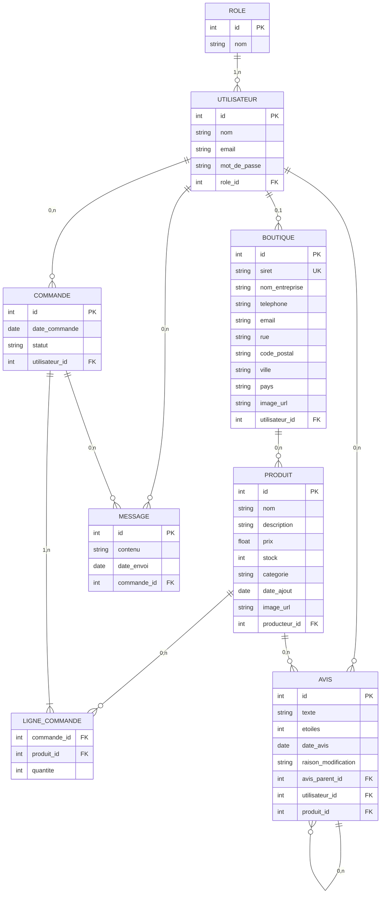

```mermaid


erDiagram
    ROLE {
        int id PK
        string nom
    }
    UTILISATEUR {
        int id PK
        string nom
        string email
        string mot_de_passe
        int role_id FK
    }
    PRODUIT {
        int id PK
        string nom
        string description
        float prix
        int stock
        string categorie
        date date_ajout
        string image_url
        int producteur_id FK
    }
    BOUTIQUE {
        int id PK
        string siret UK
        string nom_entreprise
        string telephone
        string email
        string rue
        string code_postal
        string ville
        string pays
        string image_url
        int utilisateur_id FK
    }
    COMMANDE {
        int id PK
        date date_commande
        string statut
        int utilisateur_id FK
    }
    LIGNE_COMMANDE {
        int commande_id FK
        int produit_id FK
        int quantite
    }
    MESSAGE {
        int id PK
        string contenu
        date date_envoi
        int commande_id FK
    }
    AVIS {
        int id PK
        string texte
        int etoiles
        date date_avis
        string raison_modification
        int avis_parent_id FK
        int utilisateur_id FK
        int produit_id FK
    }
    ROLE ||--o{ UTILISATEUR : "1,n"
    UTILISATEUR ||--o{ COMMANDE : "0,n"
    UTILISATEUR ||--o{ MESSAGE : "0,n"
    UTILISATEUR ||--o{ AVIS : "0,n"
    UTILISATEUR ||--o{ BOUTIQUE : "0,1"
    BOUTIQUE ||--o{ PRODUIT : "0,n"
    PRODUIT ||--o{ LIGNE_COMMANDE : "0,n"
    PRODUIT ||--o{ AVIS : "0,n"
    COMMANDE ||--|{ LIGNE_COMMANDE : "1,n"
    COMMANDE ||--o{ MESSAGE : "0,n"
    AVIS ||--o{ AVIS : "0,n"
```