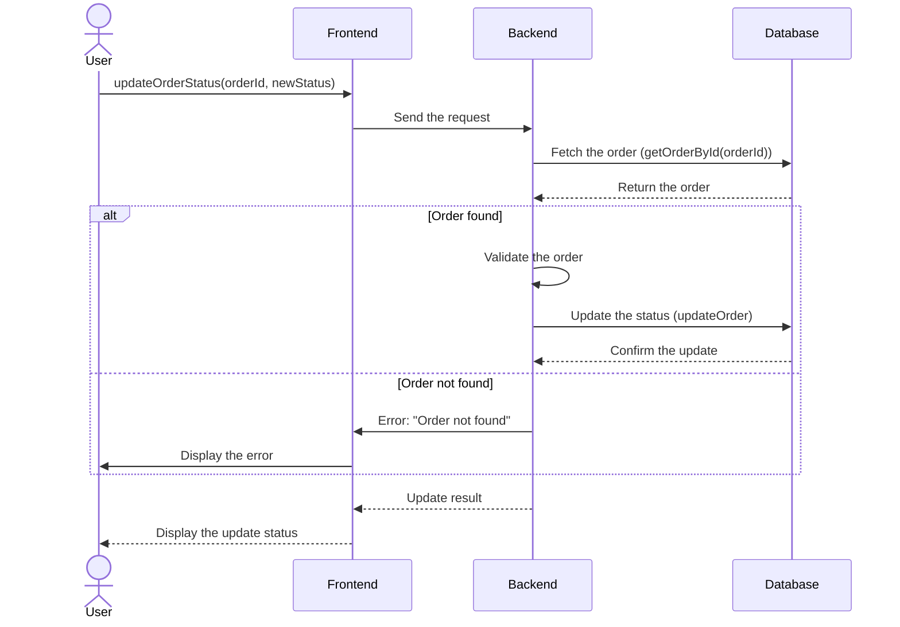

```mermaid
sequenceDiagram
    actor User
    participant Frontend
    participant Backend
    participant Database

    User ->> Frontend: updateOrderStatus(orderId, newStatus)
    Frontend ->> Backend: Send the request
    Backend ->> Database: Fetch the order (getOrderById(orderId))
    Database -->> Backend: Return the order

    alt Order found
        Backend ->> Backend: Validate the order
        Backend ->> Database: Update the status (updateOrder)
        Database -->> Backend: Confirm the update
    else Order not found
        Backend ->> Frontend: Error: "Order not found"
        Frontend ->> User: Display the error
    end

    Backend -->> Frontend: Update result
    Frontend -->> User: Display the update status
```