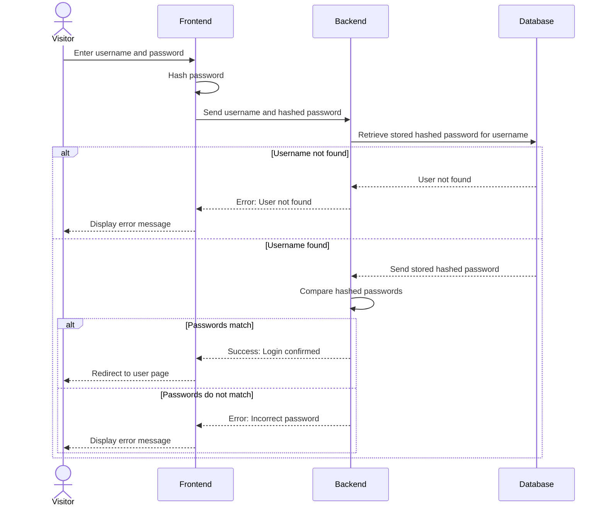

```mermaid
sequenceDiagram
    actor V as Visitor
    participant Frontend
    participant Backend
    participant Database

    %% Visitor Actions
    V ->> Frontend: Enter username and password
    Frontend ->> Frontend: Hash password
    Frontend ->> Backend: Send username and hashed password
    Backend ->> Database: Retrieve stored hashed password for username

    alt Username not found
        Database -->> Backend: User not found
        Backend -->> Frontend: Error: User not found
        Frontend -->> V: Display error message
    else Username found
        Database -->> Backend: Send stored hashed password
        Backend ->> Backend: Compare hashed passwords
        alt Passwords match
            Backend -->> Frontend: Success: Login confirmed
            Frontend -->> V: Redirect to user page
        else Passwords do not match
            Backend -->> Frontend: Error: Incorrect password
            Frontend -->> V: Display error message
        end
    end
```
